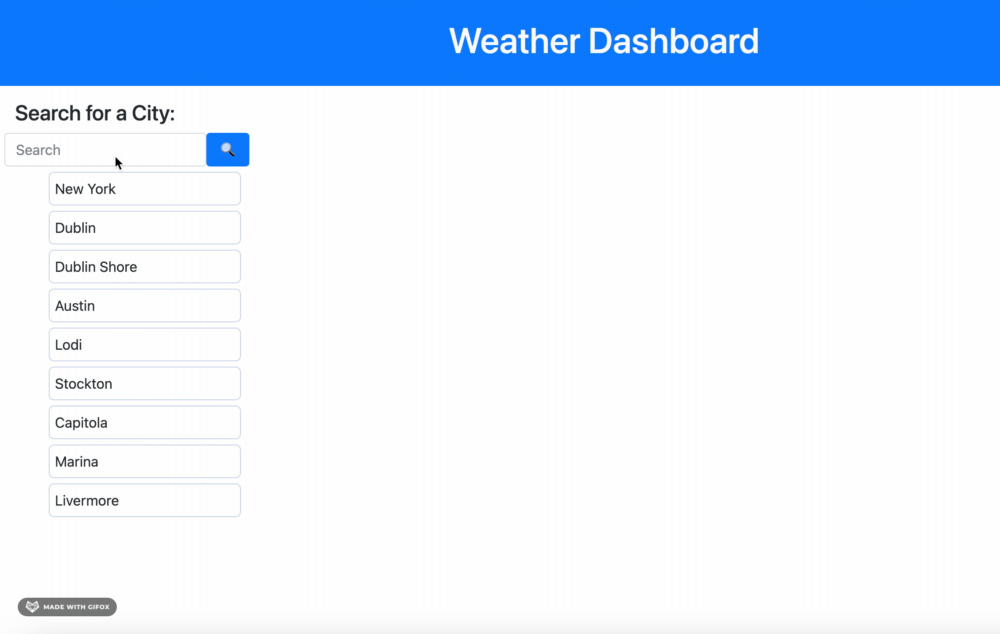
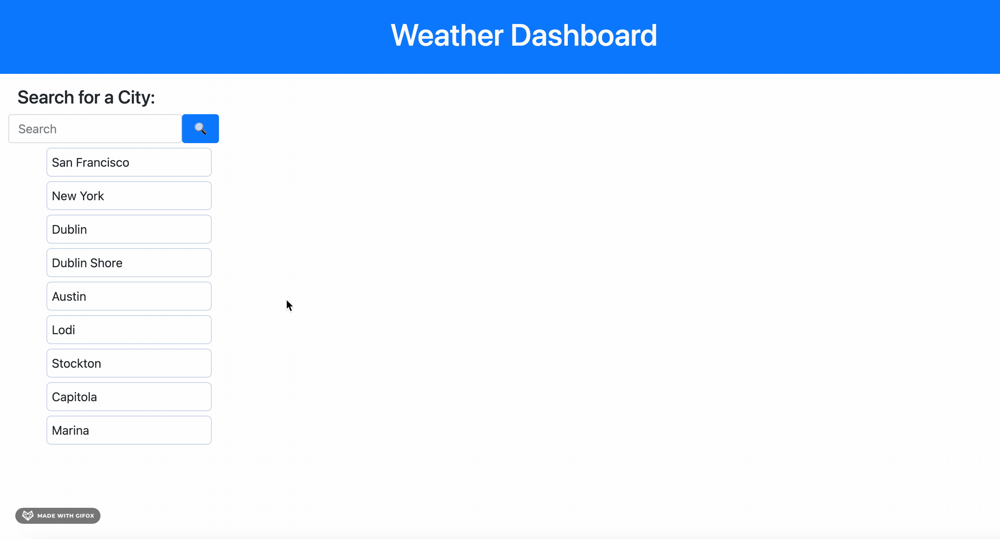

# **Weather Dashboard**
Welcome to the **Weather Dashboard**!

The Weather Dashboard is a simple web app which fetchs data from the Open Weather API and presents the user with today's weather forecast plus the next 5 following days.

The web app also uses local storage to store the user's previous search entries for easy access.

## **Usage**
To access the web app you can click [here](https://coderbennett.github.io/weather-dashboard/).

To use the Weather Dashboard the user must type in a city name and press the search button. For best results, include commas after the city and state. Just your city name might not be enough information for the app to assume the correct city you are looking for.

As seen above, the user will be given temperature, humidity, wind, and UV data. 

---

The sidebar is a great option for regular users who have locations they like to check on often. Clicking on any of the cities listed there will bring up the current weather data the same way it does when you type it in.

Keep in mind that this list has a limit of 10 entries and will remove the oldest entry when you search for something beyond that.

## **Third Party APIs Used**
The two APIs used in this project is Open Weather's [GeoCodingAPI](https://openweathermap.org/api/geocoding-api) and Open Weather's [One Call Weather API](https://openweathermap.org/api/one-call-api).

## **About the Author**
Hi there! 👋🏻 My name is Joey Bennett and I am a Jr. Web Developer learning JavaScript, jQuery, Bootstrap and getting more and more familiar with using third-party APIs.